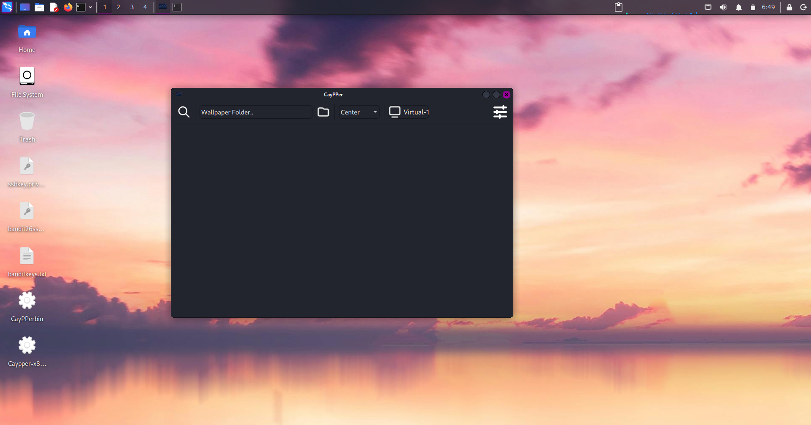
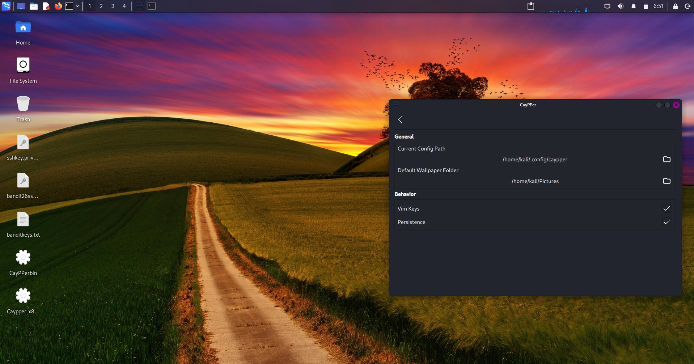
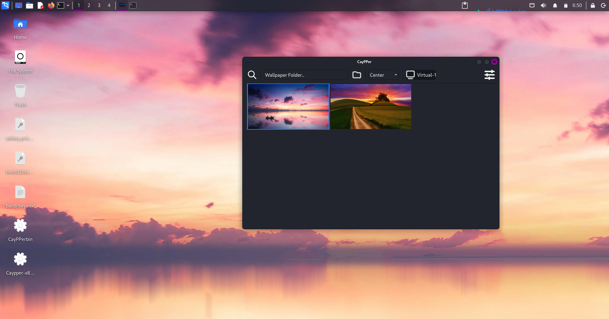
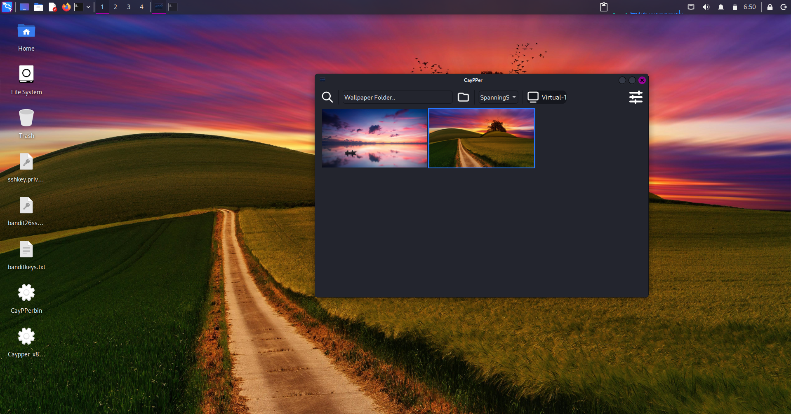
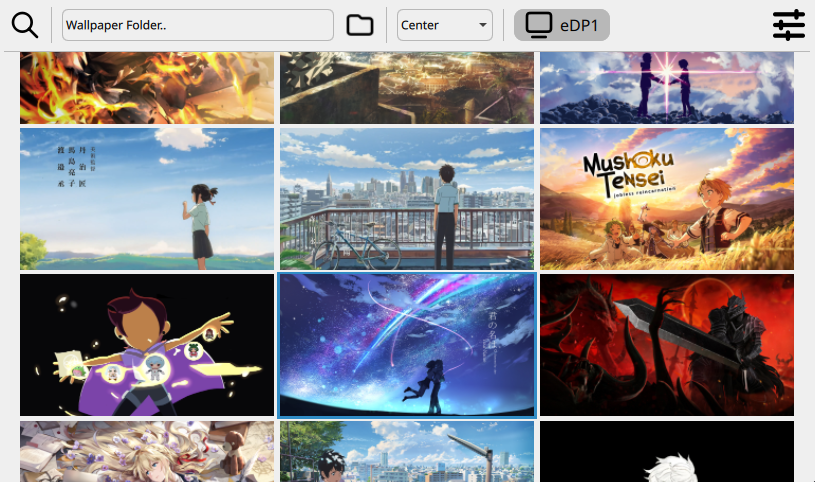
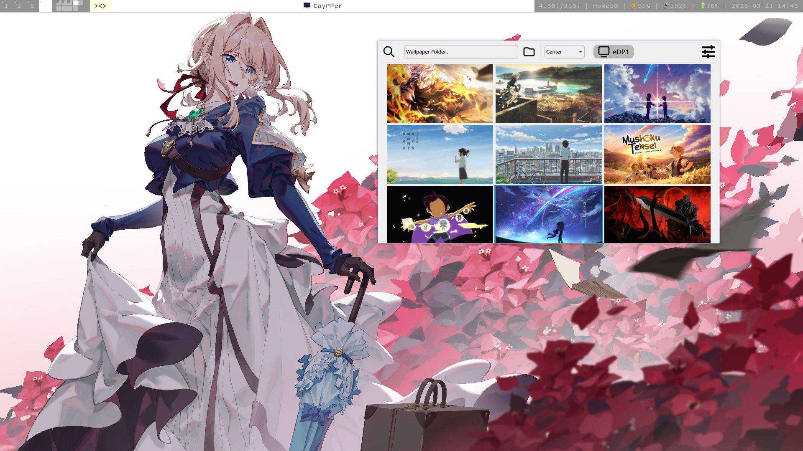
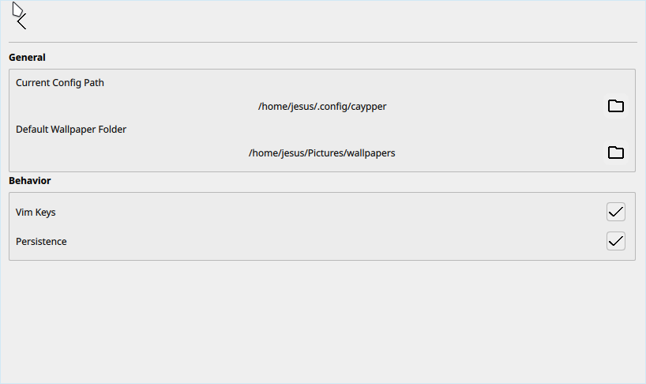
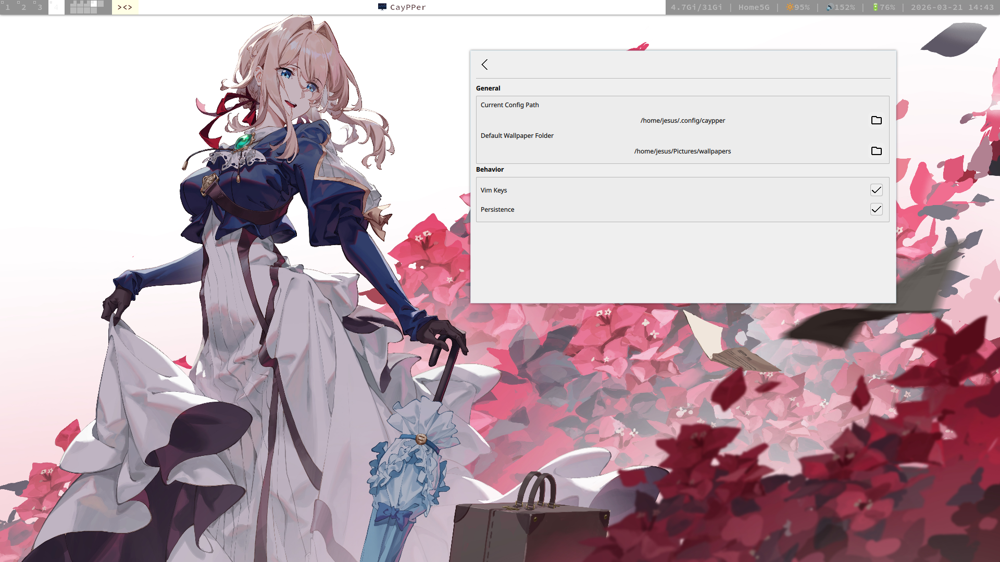

# CayPPer

> A Qt-powered wallpaper manager with multi-environment support and system theme integration.

[](https://www.gnu.org/licenses/gpl-3.0)
[](https://www.qt.io/)
[](https://isocpp.org/)
[](https://cmake.org/)

---

## Overview

CayPPer is a wallpaper manager built with Qt and C++. It automatically detects your desktop environment, respects your system theme, and lets you browse and set wallpapers without leaving the keyboard — thanks to full Vim-style navigation.

Not a Vim user? No problem — Vim keys are optional and can be toggled off at any time.

### Screenshots from App

<table>
  <tr>
    <td></td>
    <td></td>
  </tr>
  <tr>
    <td></td>
    <td></td>
  </tr>
  <tr>
  <td></td>
  <td></td>
  </tr>
  <tr>
  <td></td>
  <td></td>
  </tr>
</table>

---

## Supported Environments

| Environment | Method | Notes |
| --- | --- | --- |
| KDE | DBus | Full support |
| GNOME | gsettings | Monitor-specific wallpaper setting not yet supported |
| XFCE | xfconf-query | Full support |
| Sway | swaybg | Full support |
| Hyprland | hyprctl hyprpaper | Full support |
| X11 (generic) | xwallpaper | Full support |

---

## Installation

See [INSTALL.md](INSTALL.md) for full build and installation instructions.

### Requirements

- Qt **6.8+**
- C++ **20** or later
- CMake **3.16+**
- Ninja build system
- Environment-specific tools (e.g. `swaybg` for Sway, `xwallpaper` for X11)

---

## Keyboard Shortcuts

Vim-style navigation is built in throughout the app. You can disable it via **Settings → `gv`** if you prefer mouse-only usage.

### Main Menu

| Key | Action |
| --- | --- |
| `gs` | Open Settings |
| `gw` | Open folder dialog |
| `gr` | Focus wallpaper grid |
| `gm` | Focus fill mode selector |
| `wq` | Quit |

### Wallpaper Grid

| Key | Action |
| --- | --- |
| `h` | Move left |
| `l` | Move right |
| `j` | Move down |
| `k` | Move up |
| `gg` | Jump to first wallpaper |
| `G` | Jump to last wallpaper |
| `f` | Set highlighted wallpaper |

### Settings

| Key | Action |
| --- | --- |
| `gn` | Return to Main Menu |
| `gW` | Set default wallpaper folder |
| `gc` | Set config folder |
| `gv` | Toggle Vim keys on/off |

---

## Known Limitations

- **GNOME**: Monitor-specific wallpaper setting is not currently supported.
- **KDE**: Since KDE 6.6, the *Tile*, *Tile Horizontally*, and *Tile Vertically* fill modes have been dropped upstream due to resource usage concerns. These options remain available in CayPPer's UI but will have no effect on KDE.

---

## Uninstalling

An uninstall script is included. After installing, you can remove CayPPer by running:

```bash
sudo /usr/share/caypper/uninstall.sh
```

---

## Contributing

Contributions are welcome! Feel free to open issues for bug reports, feature requests, or environment support requests. Pull requests are appreciated.

---

## License

CayPPer is licensed under the [GNU General Public License v3.0](https://www.gnu.org/licenses/gpl-3.0).
